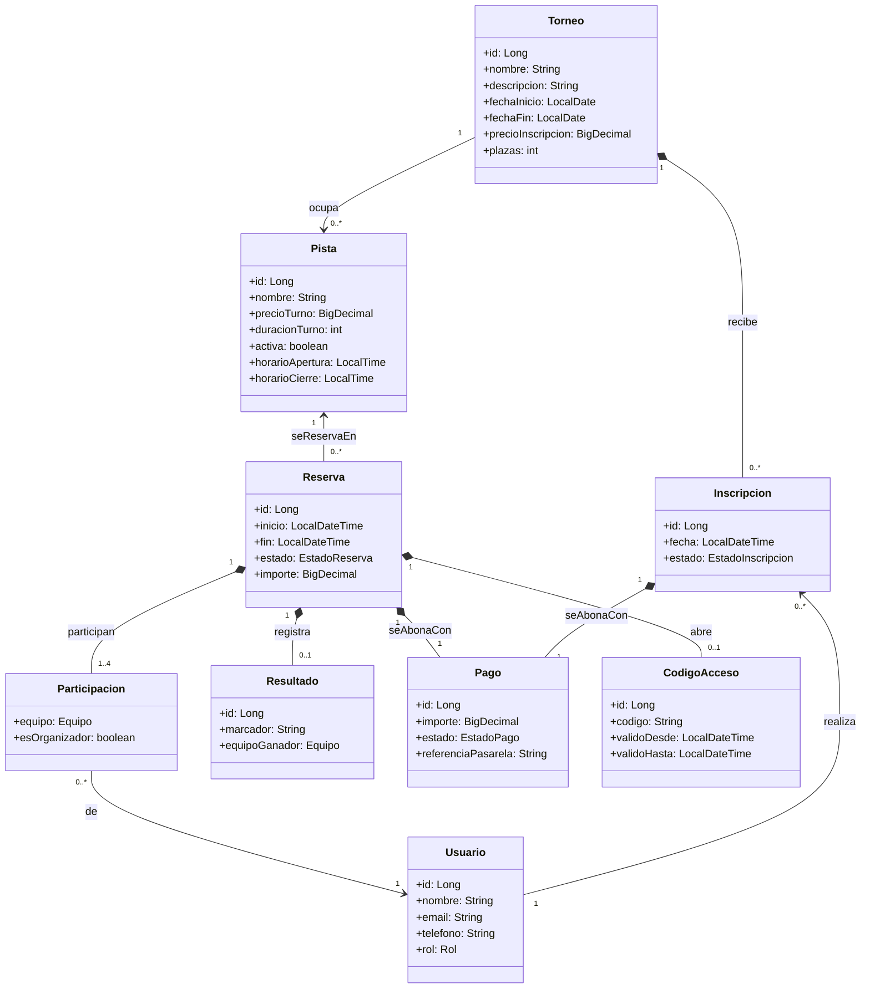
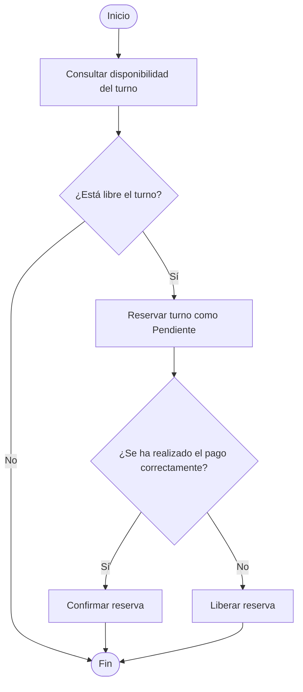
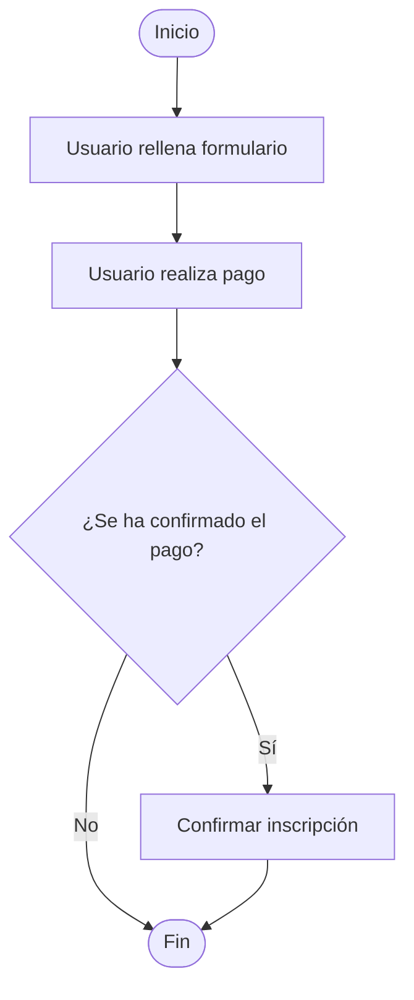
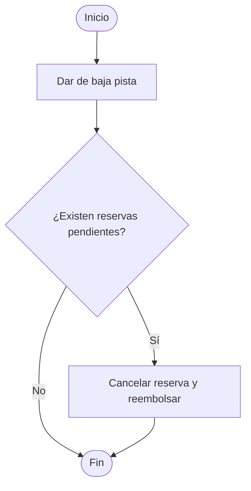
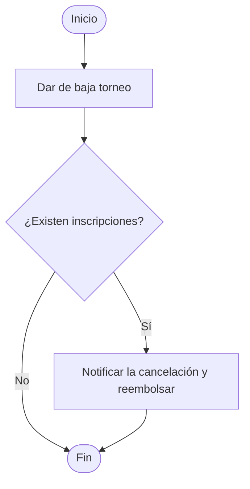

# Arquitectura
Esta sección de la documentación está orientada a que nuevos programadores o interesados puedan ojear rápidamente cómo funciona el sistema desde un alto nivel.

## Diagrama de Clases

A continuación, podremos apreciar una visión general del sistema para comprender cómo está estructurado:

### Aspectos de interés

Estas son las dudas más habituales al leer el diagrama:

- **¿Por qué una reserva tiene varios jugadores?**

  Porque el sistema ofrece estadísticas H2H y, para calcularlas, necesita saber quién jugó cada partido y en qué equipo. Por eso cada reserva puede guardar varias `Participacion`, una por jugador, que indica su equipo y si fue quien realizó la reserva. Esto no significa que varios grupos puedan reservar la misma pista a la misma hora: una franja horaria sigue teniendo una única reserva.

- **¿Por qué el código de acceso es opcional?**

  Porque cada club decide qué módulos activa. Un club que ya gestione las llaves por su cuenta puede usar solo el sistema de reservas. Por eso una reserva puede existir sin código de acceso asociado: si el módulo está desactivado, simplemente no se genera.

- **¿De dónde procede un pago?**

  Un pago nace siempre de una reserva o de una inscripción a un torneo, pero nunca de las dos a la vez. Por eso `Pago` es una clase única, compartida por ambos conceptos: así toda la lógica de cobro, devolución y facturación vive en un solo sitio, en lugar de estar duplicada en el módulo de reservas y en el de torneos.

- **¿Por qué el torneo se relaciona directamente con las pistas?**

  Un torneo puede ocupar varias pistas a la vez, por ejemplo para disputar partidos simultáneos. Esta relación permite bloquear esas pistas mientras dura el torneo y cancelar automáticamente las reservas que se solapen con él. Sin ella, habría que revisar y anular a mano cada reserva afectada.

## Diagrama de Casos de Uso

A continuación, veremos cuáles son los casos de uso del sistema. La columna *Trazabilidad* enlaza cada uno con las historias de usuario del [roadmap](./roadmap.md), donde se detallan y se ordena su implementación:

| Actor | Acción | Observaciones | Trazabilidad |
| --- | --- | --- | --- |
| Usuario | Registrarse | | [HU-02](./roadmap.md#ep-01-gestión-de-la-sesión) |
| Usuario | Iniciar sesión | | [HU-01](./roadmap.md#ep-01-gestión-de-la-sesión) |
| Usuario | Modificar sus datos personales | | [HU-04](./roadmap.md#ep-01-gestión-de-la-sesión) |
| Usuario | Consultar la disponibilidad de los turnos | | [HU-08](./roadmap.md#ep-02-gestión-de-pistas-y-disponibilidad) |
| Usuario | Realizar una reserva | La reserva pasa primero a pendiente y, si el pago se completa, a confirmada | [HU-09](./roadmap.md#ep-03-gestión-de-reservas) |
| Usuario | Inscribirse en un torneo | La inscripción pasa primero a pendiente y, si el pago se completa, a confirmada | [HU-18](./roadmap.md#ep-04-gestión-de-torneos) |
| Usuario | Obtener la factura de un pago | | [HU-26](./roadmap.md#ep-07-administración-y-facturación) |
| Administrador | Dar de alta y de baja una pista | Hay que definir qué ocurre si la pista tiene reservas futuras | [HU-05](./roadmap.md#ep-02-gestión-de-pistas-y-disponibilidad), [HU-06](./roadmap.md#ep-02-gestión-de-pistas-y-disponibilidad) |
| Administrador | Modificar la información de una pista | | [HU-07](./roadmap.md#ep-02-gestión-de-pistas-y-disponibilidad) |
| Administrador | Dar de alta y de baja usuarios | | [HU-27](./roadmap.md#ep-07-administración-y-facturación) |
| Administrador | Dar de alta y de baja un torneo | | [HU-15](./roadmap.md#ep-04-gestión-de-torneos), [HU-17](./roadmap.md#ep-04-gestión-de-torneos) |
| Administrador | Modificar la información de un torneo | Hay que definir qué ocurre si el torneo ya tiene inscripciones | [HU-16](./roadmap.md#ep-04-gestión-de-torneos) |

## Diagramas de actividad

Estos diagramas nos sirven para representar algunos de los casos de uso con aspectos más peculiares:

### Realizar una reserva

### Inscribirse en un torneo

### Dar de baja una pista

### Dar de baja un torneo

## Estructura del código

A continuación, se detalla como está organizado el proyecto: 

EN PROGRESO...